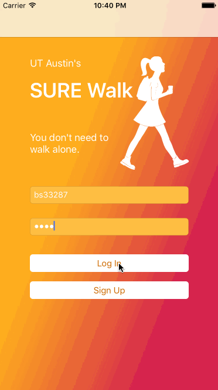
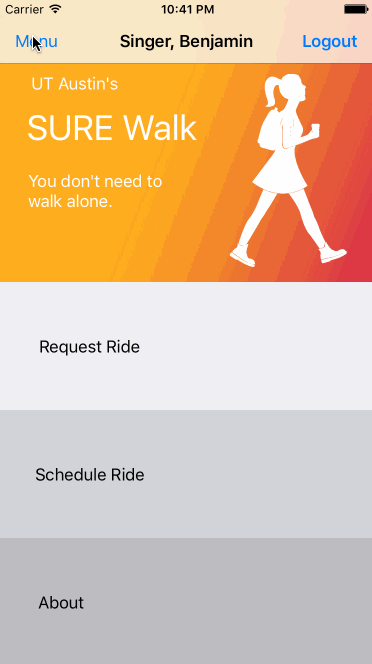
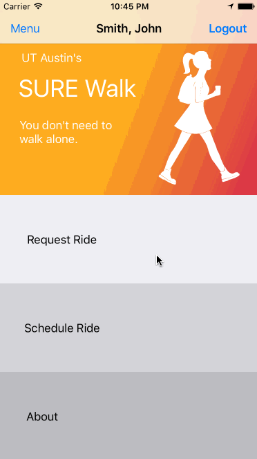

# SUREWalk iOS App
iOS app for UT Austin's [SUREWalk program](http://utsg.org/projects/sure-walk/). 

> The Students United for Rape Elimination (SURE WALK) is a student government agency partnered with PTS that offers volunteer companionship on your walk home from campus from (Monday-Sunday 8:30pm-2AM for Summer 2017), in order to protect the students, provide peace-of-mind when studying late at night, and ensure safety for all.

## User Stories

🎉 The following functionality is completed: 🎉
- [X] User login/logout  

   

- [X] User profile  

  

- [X] Request rides  

  

  - [X] Based on current location
  - [X] Geocoding
  - [X] Drag to set new location
  - [X] Path to destination overlay

- [X] No Internet connection error

🚫 The following functionality is under construction: 🔨
- [ ] Build out profile page
- [ ] Ability to add profile picture
- [ ] Schedule rides
- [ ] Better post-confirmation message
- [ ] Driving/walking time to destination
- [ ] Expanded menu
  - [ ] Past rides
